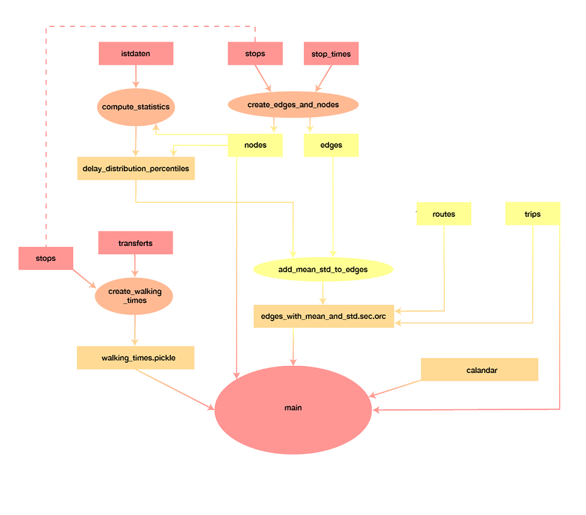
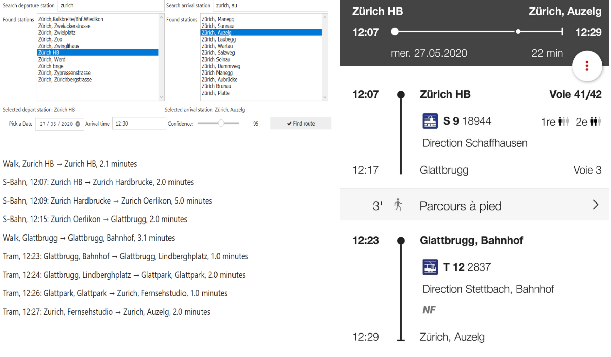

# Robust Journey Panner SBB/CFF: 

Our robust journey planner is composed of multiple jupyter notebooks. They all have a specific purpose (e.g. to create a certain data structure) but act as a whole together. However, they all are independent in the sense that by default the data is loaded from our home directories so each one of them can be run separetely, to avoid the need of running all notebooks to be able to use the planner. The actual planner is in the file `main.ipynb`. The goal of each notebook, except for `main.ipynb`, is to ease the creation of the network used by the predictive algorithm of the planner. They will create intermediate data structures to this aim.
## Video: 
The video presenting the project can be found [here](https://www.youtube.com/watch?v=KwKWkDXAXSM)

## The network:
#### Structure:
The network we use is a directed multigraph (a graph with potentially multiple edges between nodes), with stations as nodes and part of the journey as edges. In other words, nodes are  points in space (stations) and edges how someone can go from one to another. For example, an edge could be a five minute walk to change from a bus station to a train platform or a journey using any other type of transport (bus, tram, train, etc). Edges are atomic parts of a journey, so if there is an edge for a train from node A to node B it means that the transportation mode does not stop between A and B. Since the planner takes only into account a 15km radius around _Zürich HB_ the number of nodes is reasonable. However, for the number of edges to be reasonable we assume that the maximum travel time in this zone is 2 hours. Thus, the network only contains edges that occur in a 2 hour window before the arrival time. Once the network is built, all the information needed is contained in it. The attributes presents in the networks are as follows:

- Nodes: 
	- Stop ID (The id of the node)
	- Name of the station
	- Latitude
	- Longitude
- Walking edges: there can only be at most one of them between nodes as we can start to walk at any time so the only useful information is its duration. 
	- Time of departure: -1 (to distinguish them from public transport edges)
	- Duration: time to walk along the edge
- Public transport edges: 
	- Time of departure
	- Duration: time from one station to the next
	- Type of transport: bus, train, etc.
	- Id of the trip id: used to know if the user has to change transport at a given station platform
	- Mean and standard deviation of the duration: the uncertainty we compute depends on the type of transport (bus, tram, but also type of train if it is a train) and on the time of travel (e.g. probably not the same delay at 10 a.m. and 17 p.m.) for nodes at the end of a journey. As we assume that travel delays are uncorrelated between stations, we only ever calculate the delay of an edge if change from one trip to another or change from one trip to a walking edge.
	- Several duration with delays included sampled from different confidence intervals: delays we have to take into account if we want to be sure at a certain confidence level to arrive at a station. For the choice of confidence, we choose to use only the following: 0.9, 0.91, 0.92, ..., 0.99. This is because we find that fine grain enough and a lower confidence interval will likely not change the chosen journey. Furthermore, from a user point of view it does not make sense to allow much lower intervals.
 
Concerning the precomputed durations with delays, this is here just to accelerate the algorithm. From the visualisation point of view, we only allow the user to use confidence interval between 0.9 and 0.99 but the algorithm is more robust than that. It checks if the duration with the delay for this confidence level already exists and if not compute it. We chose to exclude the possibility for a user to choose other confidence level for the reasons mentionned above and to have a consistent execution time.

The policies for the delays are as follows:
- If a person change from transport to transport (that is on the same plateform as the stop ID are precise informations), he/she need at least two minutes to change (counting the delay if the user uses a confidence level)
- If a person change from transport to walking and uses a confidence level, he/she will begin to walk only when we are sure enough that the transport has arrived.
 
#### How it is built: 
Concerning the creation of the network, the following diagram illustrate the data pipeline of our project, each rectangle corresponds to a file (either created or already present in the hdfs filesystem if it is at the root level) and each ellipse is a notebook.

**create_edges_and_nodes**: This notebook creates the nodes from all stations around Zurich HB (in 15 km radius) and the edges between all stations during the day (8am to 8pm). It will then write these to the home of the person running the notebook.

**create_walking_edges**: This notebook computes the time it takes to walk between stations that are under 500m from each-other. It will then be saved as a pickle file. The time to walk is extracted from the `transfers` file present on the hdfs filesystem and otherwise is computed as 2min + 1min per 50m.

**compute_statistics**: This notebook computes the mean, standard deviation and (confidence intervals of) durations corresponding to needed confidence levels. These statistics are computed on each  type, hour and station. It uses the historical data of the SBB. More precisely, we use only real measurements when available (using `A%_PROGNOSE)` and otherwise we trust the standard measurements. It will write the created data as an ORC file in the home of the user running the notebook.

**add_statistics_to_edges**: In this notebook, the statistical data computed in `compute_mean_std.ipynb` and saved in `delay_distribution_percentiles.or` are loaded and added to the edges of our network (saved to `edges_with_mean_and_std_sec.orc`, in the home of the current user). This will later be used to create a network.

**find_train_type_correspondance**: Finds the transport types for all edges in the network (e.g. Bus, RE, etc). The transport type names do not correspond between the historical data and the data used for the schedule, hence some exploratory analysis is needed to come with some heuristic to make them correspond.

**main**: This notebook, as long as it's run from the hdfs repo of one of our users (as set in the beginning of the notebook) should be enough to obtain the desired planner as all dataframes necessary are stored on our repos. Otherwise, you are welcome to first run the other notebooks and run from your repo. This notebook will load the relevant data structures, import all functions that are needed and run the visualisation. The steps done is the visualisation that result to our planner are:
- Choose a departure station and an arrival station
- Choose an time of arrival and the day
- Choose a confidence level
- Create the graph, with edges at most 2 hours before arrival time
- Filter the nodes of the graph for those that are reachable for _Zürich HB_ (with stations in the 15km radius)
- Run our Dijkstra's algorithm

Concerning the penultimate point, we chose to filter the nodes here because the nodes reachable will depend on the day and hour. It is possible that a transport is not available at a certain time and thus the need to exclude a specific node at this time.

## Predictive algorithm: 

To find shortest paths on our network, we applied the a modified version of Dijkstra's algorithm for shortest paths. First we reversed our netowrk, meaning that now all edges pointed from their target to their source. Because we are required to enter an arrival time and not a departure, this made computations easier. 

#### Modified Dijkstra: 

Input:
- first_source : node from which we start path
- last_target : final target node
- arrival time: time from which we start algo
- graph: reversed network where edges point from their source to their target
- confidence: confidence of path

Output: shortest path from source to target

Mark all nodes unvisited: 
- dic of visited nodes: seen = {} 
- dic with final distances: dist = {}
- queue = empty

Start with the target node: 
- Assign to our target node the departure time as starting distance (instead of 0 as in normal Dijkstra): `dist[last_target] = departure_time`
- queue += (d = `departure_time`, node = `last_target`)

While the queue is not empty: 
- Take first node source in queue and its distance d, if it's not already in the dictionnary of final distances: 
 - Update dist[source] = d
 - If source == first_source of Dijkstra : STOP 
 - For all target in its direct neighbours: 
    - For all edges to target from source (multigraph): Now because we do Dijkstra on the reverse network and want to go "into the past" from the last_target node, we put all distances as negative (e.g. departure time of an edge will be -750 min instead of 750). As distances to nodes will be their departure time, this allows us to find the path that leaves the latest to arrive at our desired target (e.g. the shortest path). 
    - `dep_time_edge`= - departure_time[edge]
    - `duration_cost`= duration[edge]
    - if `dep_time_edge - duration_cost > dist[source]`(e.g the time to the source is enough to take a new connection): `current_distance = dep_time_edge`. 
    - if target not in {seen} (e.g. not been seen before) or  `current_dist < seen[target]` (e.g. there is a quicker way to neighbour): 
        - Update the seen distance to neighbour in seen dictionnary: seen[target] = current_distance
        - Push it onto queue so that we will look at its descendants later and update the final distance to target: queue += (current_distance, target)

During the implementation of this algorithm, confidence intervals are added the following way: 
- for edges that are a connection between two different public transports, a connection can be only made if there is at least 2 minute transfer time + enough time if a delay sampled from the given interval is added
- for connections from public transport to walking, a walking edge will leave later if a delay is sampled from the last public transport edge
- a final path is validated for the input confidence, meaning that for each edge that could cause problems in the path (e.g transport 1 -> transport 2 or transport -> walk), we sample a delay and see if the path remains feasible. This operation is repeated a hundred times. At the end, if the percentage of feasible paths is lower than the desired confidence, we increase our input confidence by 0.1 (e.g. from 0.9 to 0.91) and repeat Dijkstra's algorithm to find a new path. This operation is repeated till it finds a path validated to the desired confidence or no path. 

For more information about the algorithms, you are more than welcome to look at the source code.

## Example schedule, comparison with SBB
Let's try our planner and compare it to SBB's planner. We'll try to go from 'Zürich HB' to 'Zürich, Auzelg' on Wednesday 27-05-2020 and we want to arrive at 12:30 with confidence 95%. Here is our planner results and SBB's planner:

 

 

We notice that the route we suggest is in fact exactly the same as one of the routes SBB suggests:
- S-Bahn from Zürich HB to Glattbrugg
- Small walk from Glattbrug to Glattbrugg, Bahnhof
- Tram from Glattbrug, Bahnhof to Zürich, Auzelg. Arriving at 12:29

## Possible improvements
The first thing that feels odd is that because the user will input the arrival time, we run the Dijsktra with a reversed network. This makes that the walking  travels in the output don't start walking when arriving at a station, but start walking to arrive exactly when the next transport is. This is not a major problem as the overall output will be the same, but still could be improved.

Another improvement could be to have better statistics on the transport's durations. We use a gaussian distribution for the pre-computed durations with delay and t-distribution for the durations computed on the fly in the algorithm. This discrepancy is present simply because of a lack of time. In the end, the vast majority of the computed paths will stay the same as the difference between the two is not huge and most of the time the time available to change of train is big enough. So this is more of a thoeretical flaw than a problem in our planner.\
Also we could ignore the historical data if there is not enough of it. Because, can we really trust a computed mean and standard deviation if we only have two or three sample?\
Finally, a inherent potential problem with our statistics is that we do not take into account the direction of the transport. It may be possible that at a certain bus station for example, one direction has more delays that the other (because it leaves the center of a city for example). Adding the direction to that _keys_ of the statistics would thus make them more robust.

## Contributions
- **Marijn Van Der Meer**: 
	- elaboration and implementation of network
	- elaboration and implementation of Dijkstra's algorithm for shortest path on normal graph
	- reverse graph and elaboration and implementation of Dijkstra's algorithm for shortest path on reversed graph
	- elaboration and implementation of validation algorithms
- **Lucien Iseli**:
	- elaboration and implementation of network
	- computation of statistical informations
	- computation of information for edges of network (train types, walking edges)
	- implementation of visualisation
- **Florian Ravasi**:
	- elaboration and implementation of network
	- computation of statistical informations
	- computation of information for edges of network (train types, walking edges)
	- implementation of visualisation
- **Jules Gottraux**:
	- elaboration and implementation of network
	- elaboration and implementation of Dijkstra's algorithm for shortest path on normal graph
	- reverse graph and elaboration and implementation of Dijkstra's algorithm for shortest path on reversed graph
	- elaboration and implementation of validation algorithms
